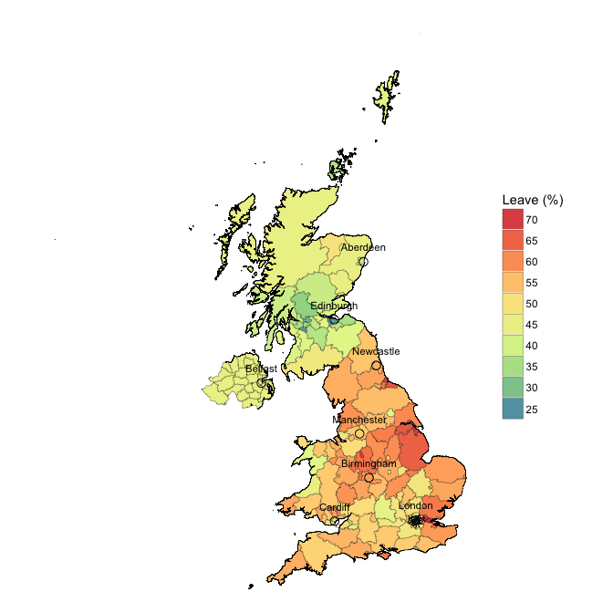

# Breaking Down Brexit
Benjamin Rouillé d'Orfeuil  
June 2016  

This past June, the United Kingdom had a referendum to decide wheter they want to *remain* or *leave* the European Union (EU). As a French citizen and a ardent member of the EU, I was interested by the outcome of the vote. Also, I have close family who reside and work in England, and the result will affect their lives.


For this analysis, the necessary libaries are loaded.  

```r
library("knitr")
library("googleVis")
library("rgdal")
library("maptools")
library("dplyr")
library("ggplot2")
library("ggmap")
library("scales")
library("httr")
library("XML")
library("RColorBrewer")
library("grDevices")
```


## Data
The results of the vote have been downloaded from [The Electoral Commission](http://www.electoralcommission.org.uk)'s website. The commission is an independent elections watchdog and regulator of party and election finance that has been set up by the UK Parliament. The file contains the EU referendum results for all 326 English disctricts, the 22 principal areas of Wales, the 32 unitary authorities of Scotland, Northern Ireland and Gibraltar. In sum, there are 382 local areas declared.

```r
fileName <- "~/DataScience/Brexit/EU-referendum-result-data.csv"
data <- read.csv(fileName, header = TRUE)
data$Area <- gsub("St\\.", "St", data$Area)
```


## Final Result

```r
final <- with(data, 
              data.frame(choice = c("Remain","Leave"), 
                         vote   = c(sum(Remain),sum(Leave) ), 
                         pct    = c(sum(Remain)/sum(Valid_Votes),sum(Leave)/sum(Valid_Votes) ) ) )

pie.final <- gvisPieChart(final, options = list(width = 500, height = 500, 
                                                title = "EU Referendum Result", 
                                                legend = "none", 
                                                pieSliceText = "label") )
plot(pie.final)
```

<!-- PieChart generated in R 3.2.1 by googleVis 0.5.10 package -->
<!-- Fri Oct 28 10:44:39 2016 -->


<!-- jsHeader -->
<script type="text/javascript">
 
// jsData 
function gvisDataPieChartID3c00683a27c () {
var data = new google.visualization.DataTable();
var datajson =
[
 [
 "Remain",
16141241,
0.4810815802 
],
[
 "Leave",
17410742,
0.5189184198 
] 
];
data.addColumn('string','choice');
data.addColumn('number','vote');
data.addColumn('number','pct');
data.addRows(datajson);
return(data);
}
 
// jsDrawChart
function drawChartPieChartID3c00683a27c() {
var data = gvisDataPieChartID3c00683a27c();
var options = {};
options["allowHtml"] = true;
options["width"] =    500;
options["height"] =    500;
options["title"] = "EU Referendum Result";
options["legend"] = "none";
options["pieSliceText"] = "label";

    var chart = new google.visualization.PieChart(
    document.getElementById('PieChartID3c00683a27c')
    );
    chart.draw(data,options);
    

}
  
 
// jsDisplayChart
(function() {
var pkgs = window.__gvisPackages = window.__gvisPackages || [];
var callbacks = window.__gvisCallbacks = window.__gvisCallbacks || [];
var chartid = "corechart";
  
// Manually see if chartid is in pkgs (not all browsers support Array.indexOf)
var i, newPackage = true;
for (i = 0; newPackage && i < pkgs.length; i++) {
if (pkgs[i] === chartid)
newPackage = false;
}
if (newPackage)
  pkgs.push(chartid);
  
// Add the drawChart function to the global list of callbacks
callbacks.push(drawChartPieChartID3c00683a27c);
})();
function displayChartPieChartID3c00683a27c() {
  var pkgs = window.__gvisPackages = window.__gvisPackages || [];
  var callbacks = window.__gvisCallbacks = window.__gvisCallbacks || [];
  window.clearTimeout(window.__gvisLoad);
  // The timeout is set to 100 because otherwise the container div we are
  // targeting might not be part of the document yet
  window.__gvisLoad = setTimeout(function() {
  var pkgCount = pkgs.length;
  google.load("visualization", "1", { packages:pkgs, callback: function() {
  if (pkgCount != pkgs.length) {
  // Race condition where another setTimeout call snuck in after us; if
  // that call added a package, we must not shift its callback
  return;
}
while (callbacks.length > 0)
callbacks.shift()();
} });
}, 100);
}
 
// jsFooter
</script>
 
<!-- jsChart -->  
<script type="text/javascript" src="https://www.google.com/jsapi?callback=displayChartPieChartID3c00683a27c"></script>
 
<!-- divChart -->
  
<div id="PieChartID3c00683a27c" 
  style="width: 500; height: 500;">
</div>
* Number of local areas declared: 382
* Total (Eligible) Electorate: 46,500,001
* Turnout: 72.2%
* Rejected Ballots: 25,359


## Results by Countries of the United Kingdom

```r
country <- with(data,
                data.frame(Country = c("England","Scotland","Wales","Northern Ireland"),
                           Remain = 100*c(sum(Remain[grep("E",Region_Code)])
                                          /sum(Valid_Votes[grep("E",Region_Code)]),
                                          sum(Remain[grep("S",Region_Code)])
                                          /sum(Valid_Votes[grep("S",Region_Code)]),
                                          sum(Remain[grep("W",Region_Code)])
                                          /sum(Valid_Votes[grep("W",Region_Code)]),
                                          sum(Remain[grep("N",Region_Code)])
                                          /sum(Valid_Votes[grep("N",Region_Code)]) ),
                           Leave =  100*c(sum(Leave[grep("E",Region_Code)])
                                          /sum(Valid_Votes[grep("E",Region_Code)]),
                                          sum(Leave[grep("S",Region_Code)])
                                          /sum(Valid_Votes[grep("S",Region_Code)]),
                                          sum(Leave[grep("W",Region_Code)])
                                          /sum(Valid_Votes[grep("W",Region_Code)]),
                                          sum(Leave[grep("N",Region_Code)])
                                          /sum(Valid_Votes[grep("N",Region_Code)]) ) ) )

bar.country <- gvisColumnChart(country, xvar = "Country", yvar = c("Remain","Leave"),
                               options = list(legend = "none", 
                                              axisTitlesPosition = "in",
                                              vAxes = "[{title:'%'}]") )
plot(bar.country)
```

<!-- ColumnChart generated in R 3.2.1 by googleVis 0.5.10 package -->
<!-- Fri Oct 28 10:44:39 2016 -->


<!-- jsHeader -->
<script type="text/javascript">
 
// jsData 
function gvisDataColumnChartID3c0093f6a1f () {
var data = new google.visualization.DataTable();
var datajson =
[
 [
 "England",
46.62382208,
53.37617792 
],
[
 "Scotland",
61.9960045,
38.0039955 
],
[
 "Wales",
47.47298421,
52.52701579 
],
[
 "Northern Ireland",
55.77517658,
44.22482342 
] 
];
data.addColumn('string','Country');
data.addColumn('number','Remain');
data.addColumn('number','Leave');
data.addRows(datajson);
return(data);
}
 
// jsDrawChart
function drawChartColumnChartID3c0093f6a1f() {
var data = gvisDataColumnChartID3c0093f6a1f();
var options = {};
options["allowHtml"] = true;
options["legend"] = "none";
options["axisTitlesPosition"] = "in";
options["vAxes"] = [{title:'%'}];

    var chart = new google.visualization.ColumnChart(
    document.getElementById('ColumnChartID3c0093f6a1f')
    );
    chart.draw(data,options);
    

}
  
 
// jsDisplayChart
(function() {
var pkgs = window.__gvisPackages = window.__gvisPackages || [];
var callbacks = window.__gvisCallbacks = window.__gvisCallbacks || [];
var chartid = "corechart";
  
// Manually see if chartid is in pkgs (not all browsers support Array.indexOf)
var i, newPackage = true;
for (i = 0; newPackage && i < pkgs.length; i++) {
if (pkgs[i] === chartid)
newPackage = false;
}
if (newPackage)
  pkgs.push(chartid);
  
// Add the drawChart function to the global list of callbacks
callbacks.push(drawChartColumnChartID3c0093f6a1f);
})();
function displayChartColumnChartID3c0093f6a1f() {
  var pkgs = window.__gvisPackages = window.__gvisPackages || [];
  var callbacks = window.__gvisCallbacks = window.__gvisCallbacks || [];
  window.clearTimeout(window.__gvisLoad);
  // The timeout is set to 100 because otherwise the container div we are
  // targeting might not be part of the document yet
  window.__gvisLoad = setTimeout(function() {
  var pkgCount = pkgs.length;
  google.load("visualization", "1", { packages:pkgs, callback: function() {
  if (pkgCount != pkgs.length) {
  // Race condition where another setTimeout call snuck in after us; if
  // that call added a package, we must not shift its callback
  return;
}
while (callbacks.length > 0)
callbacks.shift()();
} });
}, 100);
}
 
// jsFooter
</script>
 
<!-- jsChart -->  
<script type="text/javascript" src="https://www.google.com/jsapi?callback=displayChartColumnChartID3c0093f6a1f"></script>
 
<!-- divChart -->
  
<div id="ColumnChartID3c0093f6a1f" 
  style="width: 500; height: automatic;">
</div>

```r
map.country <- gvisGeoChart(country, locationvar = "Country", colorvar = "Leave",
                            options = list(region = "GB", 
                                           displayMode = "regions", 
                                           resolution = "provinces", 
                                           colorAxis = "{colors:['blue','red']}") )

plot(map.country)
```

<!-- GeoChart generated in R 3.2.1 by googleVis 0.5.10 package -->
<!-- Fri Oct 28 10:44:39 2016 -->


<!-- jsHeader -->
<script type="text/javascript">
 
// jsData 
function gvisDataGeoChartID3c0022501df7 () {
var data = new google.visualization.DataTable();
var datajson =
[
 [
 "England",
53.37617792 
],
[
 "Scotland",
38.0039955 
],
[
 "Wales",
52.52701579 
],
[
 "Northern Ireland",
44.22482342 
] 
];
data.addColumn('string','Country');
data.addColumn('number','Leave');
data.addRows(datajson);
return(data);
}
 
// jsDrawChart
function drawChartGeoChartID3c0022501df7() {
var data = gvisDataGeoChartID3c0022501df7();
var options = {};
options["width"] =    556;
options["height"] =    347;
options["region"] = "GB";
options["displayMode"] = "regions";
options["resolution"] = "provinces";
options["colorAxis"] = {colors:['blue','red']};

    var chart = new google.visualization.GeoChart(
    document.getElementById('GeoChartID3c0022501df7')
    );
    chart.draw(data,options);
    

}
  
 
// jsDisplayChart
(function() {
var pkgs = window.__gvisPackages = window.__gvisPackages || [];
var callbacks = window.__gvisCallbacks = window.__gvisCallbacks || [];
var chartid = "geochart";
  
// Manually see if chartid is in pkgs (not all browsers support Array.indexOf)
var i, newPackage = true;
for (i = 0; newPackage && i < pkgs.length; i++) {
if (pkgs[i] === chartid)
newPackage = false;
}
if (newPackage)
  pkgs.push(chartid);
  
// Add the drawChart function to the global list of callbacks
callbacks.push(drawChartGeoChartID3c0022501df7);
})();
function displayChartGeoChartID3c0022501df7() {
  var pkgs = window.__gvisPackages = window.__gvisPackages || [];
  var callbacks = window.__gvisCallbacks = window.__gvisCallbacks || [];
  window.clearTimeout(window.__gvisLoad);
  // The timeout is set to 100 because otherwise the container div we are
  // targeting might not be part of the document yet
  window.__gvisLoad = setTimeout(function() {
  var pkgCount = pkgs.length;
  google.load("visualization", "1", { packages:pkgs, callback: function() {
  if (pkgCount != pkgs.length) {
  // Race condition where another setTimeout call snuck in after us; if
  // that call added a package, we must not shift its callback
  return;
}
while (callbacks.length > 0)
callbacks.shift()();
} });
}, 100);
}
 
// jsFooter
</script>
 
<!-- jsChart -->  
<script type="text/javascript" src="https://www.google.com/jsapi?callback=displayChartGeoChartID3c0022501df7"></script>
 
<!-- divChart -->
  
<div id="GeoChartID3c0022501df7" 
  style="width: 556; height: 347;">
</div>
We can see that Northern Ireland and Scotland voted *remain* while England and Wales voted *Leave*.


## Complete Breakdown of the Results

```r
area <- with(data, data.frame(Area   = sort(Area), 
                              Remain = 100*Remain[order(Area)]/Valid_Votes[order(Area)], 
                              Leave  = 100*Leave[order(Area)]/Valid_Votes[order(Area)]) )

bar.area <- gvisBarChart(area, xvar = "Area", yvar = c("Remain","Leave"), 
                         options = list(legend = "none",
                                        isStacked = "percent",
                                        vAxes = "[{textStyle:{fontSize: '16'}}]",
                                        chartArea = "{left:250,top:10,bottom:10}",
                                        width= 800, height = 10000) )
plot(bar.area)
```

<!-- BarChart generated in R 3.2.1 by googleVis 0.5.10 package -->
<!-- Fri Oct 28 10:44:39 2016 -->


<!-- jsHeader -->
<script type="text/javascript">
 
// jsData 
function gvisDataBarChartID3c0075339d04 () {
var data = new google.visualization.DataTable();
var datajson =
[
 [
 "Aberdeen City",
61.10453235,
38.89546765 
],
[
 "Aberdeenshire",
55.01183785,
44.98816215 
],
[
 "Adur",
45.43232426,
54.56767574 
],
[
 "Allerdale",
41.35292599,
58.64707401 
],
[
 "Amber Valley",
39.71687889,
60.28312111 
],
[
 "Angus",
55.26173681,
44.73826319 
],
[
 "Argyll and Bute",
60.56760309,
39.43239691 
],
[
 "Arun",
37.52153541,
62.47846459 
],
[
 "Ashfield",
30.16338062,
69.83661938 
],
[
 "Ashford",
40.57260769,
59.42739231 
],
[
 "Aylesbury Vale",
49.49500622,
50.50499378 
],
[
 "Babergh",
45.81477861,
54.18522139 
],
[
 "Barking and Dagenham",
37.56090958,
62.43909042 
],
[
 "Barnet",
62.22948091,
37.77051909 
],
[
 "Barnsley",
31.69092581,
68.30907419 
],
[
 "Barrow-in-Furness",
39.38293508,
60.61706492 
],
[
 "Basildon",
31.37583037,
68.62416963 
],
[
 "Basingstoke and Deane",
48.09923451,
51.90076549 
],
[
 "Bassetlaw",
32.16502259,
67.83497741 
],
[
 "Bath and North East Somerset",
57.85232348,
42.14767652 
],
[
 "Bedford",
48.21532312,
51.78467688 
],
[
 "Bexley",
37.04830764,
62.95169236 
],
[
 "Birmingham",
49.57843542,
50.42156458 
],
[
 "Blaby",
40.5305378,
59.4694622 
],
[
 "Blackburn with Darwen",
43.66436521,
56.33563479 
],
[
 "Blackpool",
32.54441406,
67.45558594 
],
[
 "Blaenau Gwent",
37.97195563,
62.02804437 
],
[
 "Bolsover",
29.16706376,
70.83293624 
],
[
 "Bolton",
41.70698146,
58.29301854 
],
[
 "Boston",
24.437574,
75.562426 
],
[
 "Bournemouth",
45.11563649,
54.88436351 
],
[
 "Bracknell Forest",
46.05948528,
53.94051472 
],
[
 "Bradford",
45.76826792,
54.23173208 
],
[
 "Braintree",
38.87355629,
61.12644371 
],
[
 "Breckland",
35.77663567,
64.22336433 
],
[
 "Brent",
59.73691147,
40.26308853 
],
[
 "Brentwood",
40.84660843,
59.15339157 
],
[
 "Bridgend",
45.36014527,
54.63985473 
],
[
 "Brighton and Hove",
68.61973751,
31.38026249 
],
[
 "Bristol, City of",
61.73345882,
38.26654118 
],
[
 "Broadland",
45.62692154,
54.37307846 
],
[
 "Bromley",
50.64791265,
49.35208735 
],
[
 "Bromsgrove",
44.63487206,
55.36512794 
],
[
 "Broxbourne",
33.74351313,
66.25648687 
],
[
 "Broxtowe",
45.35200073,
54.64799927 
],
[
 "Burnley",
33.38720103,
66.61279897 
],
[
 "Bury",
45.88232965,
54.11767035 
],
[
 "Caerphilly",
42.36696117,
57.63303883 
],
[
 "Calderdale",
44.32381402,
55.67618598 
],
[
 "Cambridge",
73.84556826,
26.15443174 
],
[
 "Camden",
74.94244899,
25.05755101 
],
[
 "Cannock Chase",
31.13964687,
68.86035313 
],
[
 "Canterbury",
48.95792707,
51.04207293 
],
[
 "Cardiff",
60.01509398,
39.98490602 
],
[
 "Carlisle",
39.85724578,
60.14275422 
],
[
 "Carmarthenshire",
46.25030329,
53.74969671 
],
[
 "Castle Point",
27.30060758,
72.69939242 
],
[
 "Central Bedfordshire",
43.87169089,
56.12830911 
],
[
 "Ceredigion",
54.62986261,
45.37013739 
],
[
 "Charnwood",
46.19207408,
53.80792592 
],
[
 "Chelmsford",
47.1704665,
52.8295335 
],
[
 "Cheltenham",
56.1722691,
43.8277309 
],
[
 "Cherwell",
49.69451097,
50.30548903 
],
[
 "Cheshire East",
48.82396834,
51.17603166 
],
[
 "Cheshire West and Chester",
49.3213184,
50.6786816 
],
[
 "Chesterfield",
39.9589022,
60.0410978 
],
[
 "Chichester",
49.0783184,
50.9216816 
],
[
 "Chiltern",
55.01501604,
44.98498396 
],
[
 "Chorley",
43.16618122,
56.83381878 
],
[
 "Christchurch",
41.16586151,
58.83413849 
],
[
 "City of Edinburgh",
74.43538094,
25.56461906 
],
[
 "City of London",
75.2898386,
24.7101614 
],
[
 "Clackmannanshire",
57.777166,
42.222834 
],
[
 "Colchester",
46.40040117,
53.59959883 
],
[
 "Conwy",
46.02314362,
53.97685638 
],
[
 "Copeland",
37.99773368,
62.00226632 
],
[
 "Corby",
35.75324959,
64.24675041 
],
[
 "Cornwall",
43.48323819,
56.51676181 
],
[
 "Cotswold",
51.10267963,
48.89732037 
],
[
 "County Durham",
42.45394506,
57.54605494 
],
[
 "Coventry",
44.40430147,
55.59569853 
],
[
 "Craven",
47.17059987,
52.82940013 
],
[
 "Crawley",
41.5863286,
58.4136714 
],
[
 "Croydon",
54.29254269,
45.70745731 
],
[
 "Dacorum",
49.32748945,
50.67251055 
],
[
 "Darlington",
43.81684371,
56.18315629 
],
[
 "Dartford",
35.78014502,
64.21985498 
],
[
 "Daventry",
41.3985136,
58.6014864 
],
[
 "Denbighshire",
46.00361039,
53.99638961 
],
[
 "Derby",
42.77651154,
57.22348846 
],
[
 "Derbyshire Dales",
48.43562746,
51.56437254 
],
[
 "Doncaster",
31.03676364,
68.96323636 
],
[
 "Dover",
37.84606866,
62.15393134 
],
[
 "Dudley",
32.40386701,
67.59613299 
],
[
 "Dumfries and Galloway",
53.06107637,
46.93892363 
],
[
 "Dundee City",
59.78458989,
40.21541011 
],
[
 "Ealing",
60.40217121,
39.59782879 
],
[
 "East Ayrshire",
58.6014905,
41.3985095 
],
[
 "East Cambridgeshire",
49.07665433,
50.92334567 
],
[
 "East Devon",
45.89054211,
54.10945789 
],
[
 "East Dorset",
42.37792368,
57.62207632 
],
[
 "East Dunbartonshire",
71.39833905,
28.60166095 
],
[
 "East Hampshire",
50.52081924,
49.47918076 
],
[
 "East Hertfordshire",
49.63568634,
50.36431366 
],
[
 "East Lindsey",
29.34679513,
70.65320487 
],
[
 "East Lothian",
64.60440428,
35.39559572 
],
[
 "East Northamptonshire",
41.2371134,
58.7628866 
],
[
 "East Renfrewshire",
74.31858106,
25.68141894 
],
[
 "East Riding of Yorkshire",
39.60435362,
60.39564638 
],
[
 "East Staffordshire",
36.78601327,
63.21398673 
],
[
 "Eastbourne",
42.66504809,
57.33495191 
],
[
 "Eastleigh",
47.54843968,
52.45156032 
],
[
 "Eden",
46.68327133,
53.31672867 
],
[
 "Eilean Siar",
55.23720056,
44.76279944 
],
[
 "Elmbridge",
59.53144683,
40.46855317 
],
[
 "Enfield",
55.82297343,
44.17702657 
],
[
 "Epping Forest",
37.31327747,
62.68672253 
],
[
 "Epsom and Ewell",
52.08485089,
47.91514911 
],
[
 "Erewash",
38.76597024,
61.23402976 
],
[
 "Exeter",
55.27953231,
44.72046769 
],
[
 "Falkirk",
56.76020086,
43.23979914 
],
[
 "Fareham",
44.90137311,
55.09862689 
],
[
 "Fenland",
28.6075324,
71.3924676 
],
[
 "Fife",
58.58522665,
41.41477335 
],
[
 "Flintshire",
43.62708389,
56.37291611 
],
[
 "Forest Heath",
35.02915817,
64.97084183 
],
[
 "Forest of Dean",
41.4228453,
58.5771547 
],
[
 "Fylde",
43.04419339,
56.95580661 
],
[
 "Gateshead",
43.15254764,
56.84745236 
],
[
 "Gedling",
44.44559539,
55.55440461 
],
[
 "Gibraltar",
95.91461901,
4.085380988 
],
[
 "Glasgow City",
66.58584149,
33.41415851 
],
[
 "Gloucester",
41.50239249,
58.49760751 
],
[
 "Gosport",
36.14152232,
63.85847768 
],
[
 "Gravesham",
34.62279205,
65.37720795 
],
[
 "Great Yarmouth",
28.49505267,
71.50494733 
],
[
 "Greenwich",
55.59408682,
44.40591318 
],
[
 "Guildford",
56.16755498,
43.83244502 
],
[
 "Gwynedd",
58.05138766,
41.94861234 
],
[
 "Hackney",
78.48041707,
21.51958293 
],
[
 "Halton",
42.57826321,
57.42173679 
],
[
 "Hambleton",
46.34243934,
53.65756066 
],
[
 "Hammersmith and Fulham",
70.02317988,
29.97682012 
],
[
 "Harborough",
49.251066,
50.748934 
],
[
 "Haringey",
75.57300229,
24.42699771 
],
[
 "Harlow",
31.90089489,
68.09910511 
],
[
 "Harrogate",
50.97108421,
49.02891579 
],
[
 "Harrow",
54.63169119,
45.36830881 
],
[
 "Hart",
52.39553595,
47.60446405 
],
[
 "Hartlepool",
30.43167028,
69.56832972 
],
[
 "Hastings",
45.12063134,
54.87936866 
],
[
 "Havant",
37.63609849,
62.36390151 
],
[
 "Havering",
30.34165912,
69.65834088 
],
[
 "Herefordshire, County of",
40.77583818,
59.22416182 
],
[
 "Hertsmere",
49.16347439,
50.83652561 
],
[
 "High Peak",
49.45197235,
50.54802765 
],
[
 "Highland",
55.95231463,
44.04768537 
],
[
 "Hillingdon",
43.63188044,
56.36811956 
],
[
 "Hinckley and Bosworth",
39.66549565,
60.33450435 
],
[
 "Horsham",
51.45849003,
48.54150997 
],
[
 "Hounslow",
51.05756196,
48.94243804 
],
[
 "Huntingdonshire",
45.76240656,
54.23759344 
],
[
 "Hyndburn",
33.80671201,
66.19328799 
],
[
 "Inverclyde",
63.79657863,
36.20342137 
],
[
 "Ipswich",
41.74340271,
58.25659729 
],
[
 "Isle of Anglesey",
49.05799584,
50.94200416 
],
[
 "Isle of Wight",
38.05366591,
61.94633409 
],
[
 "Isles of Scilly",
56.39044944,
43.60955056 
],
[
 "Islington",
75.21653543,
24.78346457 
],
[
 "Kensington and Chelsea",
68.69142659,
31.30857341 
],
[
 "Kettering",
39.01163114,
60.98836886 
],
[
 "King's Lynn and West Norfolk",
33.60014104,
66.39985896 
],
[
 "Kingston upon Hull, City of",
32.38410304,
67.61589696 
],
[
 "Kingston upon Thames",
61.60783394,
38.39216606 
],
[
 "Kirklees",
45.33465292,
54.66534708 
],
[
 "Knowsley",
48.43941723,
51.56058277 
],
[
 "Lambeth",
78.62236126,
21.37763874 
],
[
 "Lancaster",
48.92046933,
51.07953067 
],
[
 "Leeds",
50.30838779,
49.69161221 
],
[
 "Leicester",
51.0750367,
48.9249633 
],
[
 "Lewes",
52.072896,
47.927104 
],
[
 "Lewisham",
69.85852354,
30.14147646 
],
[
 "Lichfield",
41.18967098,
58.81032902 
],
[
 "Lincoln",
43.06283319,
56.93716681 
],
[
 "Liverpool",
58.19242068,
41.80757932 
],
[
 "Luton",
43.45119021,
56.54880979 
],
[
 "Maidstone",
41.24676024,
58.75323976 
],
[
 "Maldon",
37.41598208,
62.58401792 
],
[
 "Malvern Hills",
47.84419655,
52.15580345 
],
[
 "Manchester",
60.36399853,
39.63600147 
],
[
 "Mansfield",
29.13708647,
70.86291353 
],
[
 "Medway",
35.92082715,
64.07917285 
],
[
 "Melton",
41.8907771,
58.1092229 
],
[
 "Mendip",
51.06867313,
48.93132687 
],
[
 "Merthyr Tydfil",
43.56140655,
56.43859345 
],
[
 "Merton",
62.94005994,
37.05994006 
],
[
 "Mid Devon",
46.66083406,
53.33916594 
],
[
 "Mid Suffolk",
44.76750838,
55.23249162 
],
[
 "Mid Sussex",
53.09272461,
46.90727539 
],
[
 "Middlesbrough",
34.52035594,
65.47964406 
],
[
 "Midlothian",
62.05903053,
37.94096947 
],
[
 "Milton Keynes",
48.59339547,
51.40660453 
],
[
 "Mole Valley",
53.08416673,
46.91583327 
],
[
 "Monmouthshire",
50.44220744,
49.55779256 
],
[
 "Moray",
50.12680331,
49.87319669 
],
[
 "Neath Port Talbot",
43.15946703,
56.84053297 
],
[
 "New Forest",
42.24002148,
57.75997852 
],
[
 "Newark and Sherwood",
39.60677926,
60.39322074 
],
[
 "Newcastle upon Tyne",
50.70037131,
49.29962869 
],
[
 "Newcastle-under-Lyme",
36.95854005,
63.04145995 
],
[
 "Newham",
52.84482182,
47.15517818 
],
[
 "Newport",
44.01010197,
55.98989803 
],
[
 "North Ayrshire",
56.87662953,
43.12337047 
],
[
 "North Devon",
42.96152057,
57.03847943 
],
[
 "North Dorset",
43.59849293,
56.40150707 
],
[
 "North East Derbyshire",
37.21969314,
62.78030686 
],
[
 "North East Lincolnshire",
30.12964979,
69.87035021 
],
[
 "North Hertfordshire",
54.37480688,
45.62519312 
],
[
 "North Kesteven",
37.74002627,
62.25997373 
],
[
 "North Lanarkshire",
61.66480584,
38.33519416 
],
[
 "North Lincolnshire",
33.70056942,
66.29943058 
],
[
 "North Norfolk",
41.09421539,
58.90578461 
],
[
 "North Somerset",
47.83055529,
52.16944471 
],
[
 "North Tyneside",
46.59974265,
53.40025735 
],
[
 "North Warwickshire",
33.11640407,
66.88359593 
],
[
 "North West Leicestershire",
39.30152228,
60.69847772 
],
[
 "Northampton",
41.61639385,
58.38360615 
],
[
 "Northern Ireland",
55.77517658,
44.22482342 
],
[
 "Northumberland",
45.89387929,
54.10612071 
],
[
 "Norwich",
56.24265437,
43.75734563 
],
[
 "Nottingham",
49.1608722,
50.8391278 
],
[
 "Nuneaton and Bedworth",
33.99063453,
66.00936547 
],
[
 "Oadby and Wigston",
45.42189735,
54.57810265 
],
[
 "Oldham",
39.1367094,
60.8632906 
],
[
 "Orkney Islands",
63.16113161,
36.83886839 
],
[
 "Oxford",
70.26742682,
29.73257318 
],
[
 "Pembrokeshire",
42.85776831,
57.14223169 
],
[
 "Pendle",
36.8457042,
63.1542958 
],
[
 "Perth and Kinross",
61.09285582,
38.90714418 
],
[
 "Peterborough",
39.10655438,
60.89344562 
],
[
 "Plymouth",
40.05694803,
59.94305197 
],
[
 "Poole",
41.8277783,
58.1722217 
],
[
 "Portsmouth",
41.92058347,
58.07941653 
],
[
 "Powys",
46.25954775,
53.74045225 
],
[
 "Preston",
46.6862306,
53.3137694 
],
[
 "Purbeck",
40.92618384,
59.07381616 
],
[
 "Reading",
58.02693702,
41.97306298 
],
[
 "Redbridge",
53.97440596,
46.02559404 
],
[
 "Redcar and Cleveland",
33.81192068,
66.18807932 
],
[
 "Redditch",
37.71195676,
62.28804324 
],
[
 "Reigate and Banstead",
49.50776851,
50.49223149 
],
[
 "Renfrewshire",
64.81294466,
35.18705534 
],
[
 "Rhondda Cynon Taf",
46.30371559,
53.69628441 
],
[
 "Ribble Valley",
43.60902256,
56.39097744 
],
[
 "Richmond upon Thames",
69.29397276,
30.70602724 
],
[
 "Richmondshire",
43.22260819,
56.77739181 
],
[
 "Rochdale",
39.92695992,
60.07304008 
],
[
 "Rochford",
33.386085,
66.613915 
],
[
 "Rossendale",
39.31798539,
60.68201461 
],
[
 "Rother",
41.47115435,
58.52884565 
],
[
 "Rotherham",
32.11002497,
67.88997503 
],
[
 "Rugby",
43.29706741,
56.70293259 
],
[
 "Runnymede",
45.73757168,
54.26242832 
],
[
 "Rushcliffe",
57.55148416,
42.44851584 
],
[
 "Rushmoor",
41.78761788,
58.21238212 
],
[
 "Rutland",
49.43394583,
50.56605417 
],
[
 "Ryedale",
44.7425897,
55.2574103 
],
[
 "Salford",
43.19082093,
56.80917907 
],
[
 "Sandwell",
33.2785527,
66.7214473 
],
[
 "Scarborough",
38.00796549,
61.99203451 
],
[
 "Scottish Borders",
58.46504606,
41.53495394 
],
[
 "Sedgemoor",
38.8005379,
61.1994621 
],
[
 "Sefton",
51.86843209,
48.13156791 
],
[
 "Selby",
40.83289731,
59.16710269 
],
[
 "Sevenoaks",
45.61685312,
54.38314688 
],
[
 "Sheffield",
49.00975809,
50.99024191 
],
[
 "Shepway",
37.75427714,
62.24572286 
],
[
 "Shetland Islands",
56.51284569,
43.48715431 
],
[
 "Shropshire",
43.12623872,
56.87376128 
],
[
 "Slough",
45.67305929,
54.32694071 
],
[
 "Solihull",
43.84255843,
56.15744157 
],
[
 "South Ayrshire",
58.96172731,
41.03827269 
],
[
 "South Bucks",
49.30016698,
50.69983302 
],
[
 "South Cambridgeshire",
60.23028469,
39.76971531 
],
[
 "South Derbyshire",
39.64899903,
60.35100097 
],
[
 "South Gloucestershire",
47.323047,
52.676953 
],
[
 "South Hams",
52.85482417,
47.14517583 
],
[
 "South Holland",
26.41372204,
73.58627796 
],
[
 "South Kesteven",
40.07105528,
59.92894472 
],
[
 "South Lakeland",
52.85545912,
47.14454088 
],
[
 "South Lanarkshire",
63.08305452,
36.91694548 
],
[
 "South Norfolk",
48.30508475,
51.69491525 
],
[
 "South Northamptonshire",
45.65731845,
54.34268155 
],
[
 "South Oxfordshire",
54.98157175,
45.01842825 
],
[
 "South Ribble",
41.43807671,
58.56192329 
],
[
 "South Somerset",
42.75488353,
57.24511647 
],
[
 "South Staffordshire",
35.152642,
64.847358 
],
[
 "South Tyneside",
37.95445061,
62.04554939 
],
[
 "Southampton",
46.19699995,
53.80300005 
],
[
 "Southend-on-Sea",
41.91754554,
58.08245446 
],
[
 "Southwark",
72.8120029,
27.1879971 
],
[
 "Spelthorne",
39.700401,
60.299599 
],
[
 "St Albans",
62.70808028,
37.29191972 
],
[
 "St Edmundsbury",
43.37887799,
56.62112201 
],
[
 "St Helens",
41.97525593,
58.02474407 
],
[
 "Stafford",
44.00650457,
55.99349543 
],
[
 "Staffordshire Moorlands",
35.26773762,
64.73226238 
],
[
 "Stevenage",
40.7535219,
59.2464781 
],
[
 "Stirling",
67.7150862,
32.2849138 
],
[
 "Stockport",
52.3331845,
47.6668155 
],
[
 "Stockton-on-Tees",
38.27416223,
61.72583777 
],
[
 "Stoke-on-Trent",
30.63780934,
69.36219066 
],
[
 "Stratford-on-Avon",
48.43603931,
51.56396069 
],
[
 "Stroud",
54.6095269,
45.3904731 
],
[
 "Suffolk Coastal",
47.00191958,
52.99808042 
],
[
 "Sunderland",
38.66025431,
61.33974569 
],
[
 "Surrey Heath",
49.01634643,
50.98365357 
],
[
 "Sutton",
46.28284535,
53.71715465 
],
[
 "Swale",
37.5397066,
62.4602934 
],
[
 "Swansea",
48.49097245,
51.50902755 
],
[
 "Swindon",
45.34147745,
54.65852255 
],
[
 "Tameside",
38.86360154,
61.13639846 
],
[
 "Tamworth",
32.53103563,
67.46896437 
],
[
 "Tandridge",
47.16258265,
52.83741735 
],
[
 "Taunton Deane",
47.07528943,
52.92471057 
],
[
 "Teignbridge",
46.10384877,
53.89615123 
],
[
 "Telford and Wrekin",
36.77778646,
63.22221354 
],
[
 "Tendring",
30.49953422,
69.50046578 
],
[
 "Test Valley",
48.05941989,
51.94058011 
],
[
 "Tewkesbury",
46.75314993,
53.24685007 
],
[
 "Thanet",
36.15017614,
63.84982386 
],
[
 "Three Rivers",
48.72653648,
51.27346352 
],
[
 "Thurrock",
27.71785375,
72.28214625 
],
[
 "Tonbridge and Malling",
44.30094162,
55.69905838 
],
[
 "Torbay",
36.84189702,
63.15810298 
],
[
 "Torfaen",
40.21892655,
59.78107345 
],
[
 "Torridge",
39.17304304,
60.82695696 
],
[
 "Tower Hamlets",
67.45599852,
32.54400148 
],
[
 "Trafford",
57.69086513,
42.30913487 
],
[
 "Tunbridge Wells",
54.88953166,
45.11046834 
],
[
 "Uttlesford",
49.3213715,
50.6786285 
],
[
 "Vale of Glamorgan",
50.72812513,
49.27187487 
],
[
 "Vale of White Horse",
56.69893287,
43.30106713 
],
[
 "Wakefield",
33.63592738,
66.36407262 
],
[
 "Walsall",
32.13772044,
67.86227956 
],
[
 "Waltham Forest",
59.10217317,
40.89782683 
],
[
 "Wandsworth",
75.03166882,
24.96833118 
],
[
 "Warrington",
45.73143195,
54.26856805 
],
[
 "Warwick",
58.78115122,
41.21884878 
],
[
 "Watford",
49.72953248,
50.27046752 
],
[
 "Waveney",
37.10203211,
62.89796789 
],
[
 "Waverley",
58.3879803,
41.6120197 
],
[
 "Wealden",
45.49808034,
54.50191966 
],
[
 "Wellingborough",
37.58294645,
62.41705355 
],
[
 "Welwyn Hatfield",
47.00563044,
52.99436956 
],
[
 "West Berkshire",
51.78125369,
48.21874631 
],
[
 "West Devon",
46.79870768,
53.20129232 
],
[
 "West Dorset",
48.96994984,
51.03005016 
],
[
 "West Dunbartonshire",
61.99444702,
38.00555298 
],
[
 "West Lancashire",
44.69460928,
55.30539072 
],
[
 "West Lindsey",
38.1823827,
61.8176173 
],
[
 "West Lothian",
58.25462105,
41.74537895 
],
[
 "West Oxfordshire",
53.65534254,
46.34465746 
],
[
 "West Somerset",
39.41290144,
60.58709856 
],
[
 "Westminster",
68.96516446,
31.03483554 
],
[
 "Weymouth and Portland",
38.95699909,
61.04300091 
],
[
 "Wigan",
36.10027377,
63.89972623 
],
[
 "Wiltshire",
47.51137957,
52.48862043 
],
[
 "Winchester",
58.92749162,
41.07250838 
],
[
 "Windsor and Maidenhead",
53.90013693,
46.09986307 
],
[
 "Wirral",
51.70406977,
48.29593023 
],
[
 "Woking",
56.15073975,
43.84926025 
],
[
 "Wokingham",
56.68864935,
43.31135065 
],
[
 "Wolverhampton",
37.42538326,
62.57461674 
],
[
 "Worcester",
46.32275669,
53.67724331 
],
[
 "Worthing",
47.01463351,
52.98536649 
],
[
 "Wrexham",
40.96012279,
59.03987721 
],
[
 "Wychavon",
42.13695689,
57.86304311 
],
[
 "Wycombe",
51.96856208,
48.03143792 
],
[
 "Wyre",
36.227949,
63.772051 
],
[
 "Wyre Forest",
36.85452526,
63.14547474 
],
[
 "York",
58.04470803,
41.95529197 
] 
];
data.addColumn('string','Area');
data.addColumn('number','Remain');
data.addColumn('number','Leave');
data.addRows(datajson);
return(data);
}
 
// jsDrawChart
function drawChartBarChartID3c0075339d04() {
var data = gvisDataBarChartID3c0075339d04();
var options = {};
options["allowHtml"] = true;
options["legend"] = "none";
options["isStacked"] = "percent";
options["vAxes"] = [{textStyle:{fontSize: '16'}}];
options["chartArea"] = {left:250,top:10,bottom:10};
options["width"] =    800;
options["height"] =  10000;

    var chart = new google.visualization.BarChart(
    document.getElementById('BarChartID3c0075339d04')
    );
    chart.draw(data,options);
    

}
  
 
// jsDisplayChart
(function() {
var pkgs = window.__gvisPackages = window.__gvisPackages || [];
var callbacks = window.__gvisCallbacks = window.__gvisCallbacks || [];
var chartid = "corechart";
  
// Manually see if chartid is in pkgs (not all browsers support Array.indexOf)
var i, newPackage = true;
for (i = 0; newPackage && i < pkgs.length; i++) {
if (pkgs[i] === chartid)
newPackage = false;
}
if (newPackage)
  pkgs.push(chartid);
  
// Add the drawChart function to the global list of callbacks
callbacks.push(drawChartBarChartID3c0075339d04);
})();
function displayChartBarChartID3c0075339d04() {
  var pkgs = window.__gvisPackages = window.__gvisPackages || [];
  var callbacks = window.__gvisCallbacks = window.__gvisCallbacks || [];
  window.clearTimeout(window.__gvisLoad);
  // The timeout is set to 100 because otherwise the container div we are
  // targeting might not be part of the document yet
  window.__gvisLoad = setTimeout(function() {
  var pkgCount = pkgs.length;
  google.load("visualization", "1", { packages:pkgs, callback: function() {
  if (pkgCount != pkgs.length) {
  // Race condition where another setTimeout call snuck in after us; if
  // that call added a package, we must not shift its callback
  return;
}
while (callbacks.length > 0)
callbacks.shift()();
} });
}, 100);
}
 
// jsFooter
</script>
 
<!-- jsChart -->  
<script type="text/javascript" src="https://www.google.com/jsapi?callback=displayChartBarChartID3c0075339d04"></script>
 
<!-- divChart -->
  
<div id="BarChartID3c0075339d04" 
  style="width: 800; height: 10000;">
</div>


## Map of Results by Administrative Area
I use the [Global Administrative Areas](http://www.gadm.org/) (GADM) spatial database to obtain the location of the administrative areas of the UK. 

```r
uk.map <- readOGR(dsn = "GBR_adm_shp", layer = "GBR_adm2", verbose = FALSE)
uk.map@data$NAME_2 <- as.character(uk.map@data$NAME_2)
```

There are a couple of issues associated with the file provided by the GADM. First, the name of some of the administrative areas in the file are either incomplete or misspelled. I fix these entries below. 

```r
uk.map@data$NAME_2[56]  <- "City of London"
uk.map@data$NAME_2[140] <- "Aberdeen City"
uk.map@data$NAME_2[145] <- "Dundee City"
uk.map@data$NAME_2[150] <- "City of Edinburgh"
uk.map@data$NAME_2[154] <- "Glasgow City"
uk.map@data$NAME_2[159] <- "North Ayrshire"
uk.map@data$NAME_2[162] <- "Perth and Kinross"
uk.map@data$NAME_2[171] <- "Isle of Anglesey"
uk.map@data$NAME_2[188] <- "Rhondda Cynon Taf"
```

Then, 192 adminstrative areas are given for England by GADM. The term administrative area includes both districts and ceremonial counties, which are larger subdivisions of England than districts. I extract from Wikipedia a list of English districts along with a list of ceremonial counties to which they belong.

```r
url <- "https://en.wikipedia.org/wiki/List_of_English_districts"
tables <- GET(url)
tables <- readHTMLTable(rawToChar(tables$content) )
n.rows <- unlist(lapply(tables, function(t) dim(t)[1]) )

districts <- tables[[which.max(n.rows)]]
names(districts) <- c("Name", "Website", "Population2015", "Type", "CeremonialCounty")
districts$Name <- gsub("&", "and", districts$Name)
districts$Name[133] <- "Kingston upon Hull"
districts$id     <- NA
districts$Leave  <- 0
districts$Remain <- 0
districts$Valid  <- 0
```

Employing the English ceremonial county/district information from Wikipedia, I can now cross-correlate the election data from the Electoral Commission to the 192 GADM administrative areas.

```r
wEngland <- which(uk.map@data$NAME_1 == "England")
for(i in wEngland ) {
    if(uk.map$TYPE_2[i] == "Administrative County" | uk.map$TYPE_2[i] == "Metropolitan County" |
       uk.map$TYPE_2[i] == "County" | uk.map$TYPE_2[i] == "Metropolitan Borough (city)") {
        match <- grep(uk.map$NAME_2[i], districts$CeremonialCounty)
        for(j in match) if(is.na(districts$id[j]) ) districts$id[j] <- uk.map$ID_2[i]
    } else {
        match <- match(uk.map$NAME_2[i], districts$Name)
        districts$id[match] <- uk.map$ID_2[i]
    }
}

for(i in 1:nrow(districts) ) {
    match <- match(districts$Name[i], data$Area)
    if(is.na(match) ) match <- grep(districts$Name[i], data$Area)
    districts$Leave[i]  <- data$Leave[match]
    districts$Remain[i] <- data$Remain[match]
    districts$Valid[i]  <- data$Valid_Votes[match]
}

england <- with(districts, data.frame(Name   = uk.map@data$NAME_2[wEngland],
                                      Leave  = tapply(Leave, id, sum, na.rm = TRUE),
                                      Remain = tapply(Remain, id, sum, na.rm = TRUE),
                                      Valid  = tapply(Valid, id, sum, na.rm = TRUE),
                                      id     = uk.map@data$ID_2[wEngland]) )
```

Though 11 administrative areas have been assigned to Northern Island by the GADM, the Electoral Commision relays only one overall set of results.

```r
wIreland <- which(uk.map@data$NAME_1 == "Northern Ireland")
ireland <- with(data, data.frame(Name   = uk.map@data$NAME_2[wIreland],
                                 Leave  = rep(Leave[grep("N",Region_Code)], each = length(wIreland) ),
                                 Remain = rep(Remain[grep("N",Region_Code)], each = length(wIreland) ),
                                 Valid  = rep(Valid_Votes[grep("N",Region_Code)], each = length(wIreland) ),
                                 id     = uk.map@data$ID_2[wIreland]) )
```

For Scotland, it was possible to perform one-to-one matching between the Electoral Commission data and the GADM administrative areas.

```r
scotland <- with(data, data.frame(Name   = Area[grep("S",Region_Code)], 
                                  Leave  = Leave[grep("S",Region_Code)], 
                                  Remain = Remain[grep("S",Region_Code)], 
                                  Valid  = Valid_Votes[grep("S",Region_Code)],
                                  id     = rep(NA,length(grep("S",Region_Code) ) ) ) )

for(i in 1:nrow(scotland) ) {
    match <- match(scotland$Name[i],uk.map@data$NAME_2)
    scotland$id[i] <- uk.map@data$ID_2[match]
}
```

The same is true for Wales.

```r
wales <- with(data, data.frame(Name   = Area[grep("W",Region_Code)], 
                               Leave  = Leave[grep("W",Region_Code)], 
                               Remain = Remain[grep("W",Region_Code)], 
                               Valid  = Valid_Votes[grep("W",Region_Code)],
                               id     = length(grep("W",Region_Code) ) ) )

for(i in 1:nrow(wales) ) {
    match <- match(wales$Name[i],uk.map@data$NAME_2)
    wales$id[i] <- uk.map@data$ID_2[match]
}
```

For display purposes, a vector of longitudes and latitudes for major cities in the UK is created.

```r
cities.name <- c("Birmingham, UK", "London, UK", "Manchester, UK", "Newcastle, UK", 
                 "Belfast, UK", "Aberdeen, UK", "Edinburgh, UK", "Cardiff, UK")
cities.coordinates <- geocode(cities.name, messaging = FALSE)
cities.lon <- cities.coordinates$lon
cities.lat <- cities.coordinates$lat
```

Finally, the map is produced.

```r
uk <- rbind(england, ireland, scotland, wales)
uk$pct_Leave  <- 100*uk$Leave/uk$Valid
uk$pct_Remain <- 100*uk$Remain/uk$Valid

uk.points <- fortify(uk.map, region = "ID_2")
uk$id <- as.character(uk$id)
uk.plot <- left_join(uk.points,uk)

map <- ggplot() + 
       geom_polygon(data = uk.plot, aes(x = long, y = lat, group = group, fill = pct_Leave), 
                    color = "black", size = 0.1) +
       scale_fill_distiller(palette = "Spectral", breaks = pretty_breaks(n = 8) ) +
       guides(fill = guide_legend(reverse = TRUE) ) +
       labs(fill = "Leave (%)") +
       theme_nothing(legend = TRUE) + 
       xlim(range(uk.plot$long) ) + ylim(range(uk.plot$lat) ) +
       coord_map()

map <- map + 
       geom_point(aes(x = cities.lon, y = cities.lat), color = "black", size = 3, shape = 21) +
       geom_text(aes(x = cities.lon, y = cities.lat, label = gsub(", UK", "", cities.name) ), 
                 hjust = 0.5, vjust = -1.5, colour = "black", size = 3)

plot(map)
```

<!-- -->


